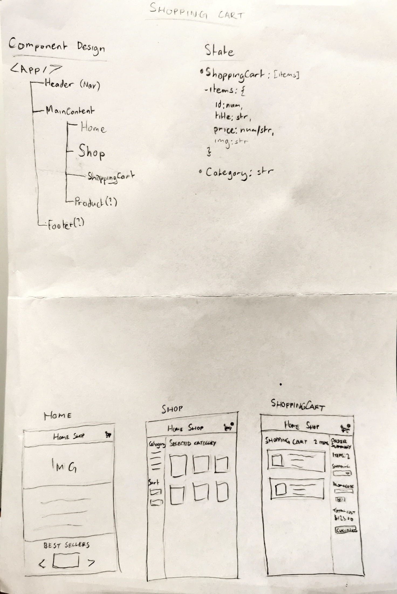

# Ecom Store

A simple ecommerce store that replicates displaying/sorting products, as well as adding items to the cart.

- [Visit the preview](https://ish-ecom-store.netlify.app/)
- Utilises the [Fake Store API](https://fakestoreapi.com/)

## Technologies Used

- Vite
- React
- JavaScript
- CSS

## Installation

1. **Clone the repository**:

   ```bash
   git clone https://github.com/ishmyles/ecom-store.git
   cd ecom-store
   ```

2. **Install dependencies**:

   ```bash
   npm install
   ```

3. **Start the application**:

   ```bash
   npm run dev
   ```

   The app will be accessible at `http://localhost:5173`.

4. **Terminating the application**:

   Press Ctrl + C to terminate app.

## App Design


